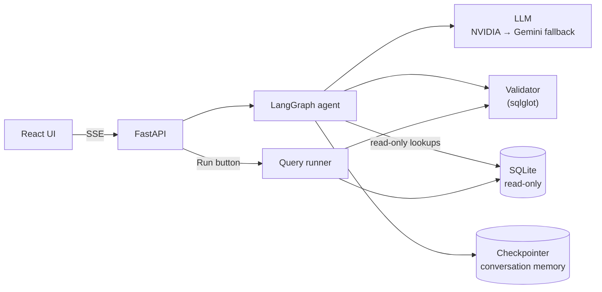

# SQL Query Agent

An AI assistant that turns plain-English questions into **validated, read-only SQL**,
explains the query in simple terms, and helps **optimize** and **debug** SQL you paste in.
It works only with the provided database schema and politely refuses everything else.

Built with **LangGraph**, FastAPI, React and SQLite.

```
You:    Show all employees hired after January 2024
Agent:  SELECT * FROM Employees WHERE HireDate >= '2024-01-01'
        "This query retrieves all employees whose hire date is on or after January 1, 2024."

You:    Only those in Engineering
Agent:  (modifies the previous query instead of starting over)

You:    Who won the FIFA World Cup?
Agent:  I'm designed to assist only with SQL and database-related tasks. …
```

## Contents

- [Features](#features)
- [Quick start](#quick-start)
- [Manual setup](#manual-setup)
- [Configuration](#configuration)
- [Using the app](#using-the-app)
- [Tests](#tests)
- [How it works](#how-it-works)
- [Project structure](#project-structure)
- [Assumptions and limitations](#assumptions-and-limitations)
- [Troubleshooting](#troubleshooting)
- [Where to find each deliverable](#where-to-find-each-deliverable)

## Features

**Agent**
- Natural language → SQL, grounded in the live database schema
- **Looks up real values before filtering** (e.g. checks that states are stored as `'California'`, not `'CA'`),
  using read-only data tools
- Follow-up questions modify the previous query ("only those from California")
- SQL **explanation** in plain English
- SQL **optimization**: readability, index recommendations, unnecessary joins, anti-patterns
- SQL **debugging**: finds the issue, explains why, returns a corrected query
- Questions about the schema itself ("what tables are there?")
- Clarifying questions for genuinely ambiguous requests

**Guardrails**
- Out-of-scope requests (sports, politics, maths, creative writing, …) are refused
- Destructive requests (DELETE, UPDATE, INSERT, DROP, ALTER, TRUNCATE, …) are refused
- Every query is **validated in code** before it's returned: syntax, read-only, tables, columns,
  join relationships, and a SQLite compile check. Invalid SQL goes back to the model with the exact
  errors ("Unknown column 'region'. Did you mean: Customers.State?") for up to two retries
- Queries run on a **read-only database connection**, so writes are impossible even if validation had a bug
- Prompt-injection protection: pattern checks before any LLM call, user text and database rows
  treated as data, never as instructions

**Interface**
- Chat with live progress ("Looking up data… Validating SQL…") and a streamed explanation
- SQL panel with syntax highlighting, **Copy**, **Download**, and PostgreSQL / MySQL versions
- **▶ Run** executes the query on demand (the agent never runs it on its own); results table
  with **CSV export**
- Performance panel: estimated cost, full table scans, suggested indexes
- Conversation history that survives restarts; requests keep running if you switch conversations
- Dark mode, mobile layout

## Quick start

**Prerequisites:** Python 3.11+, Node.js 20.19+ or 22.12+, and at least one free API key:

- **NVIDIA** (default model): https://build.nvidia.com, then "Get API Key"
- **Google Gemini** (fallback): https://aistudio.google.com/apikey

```bash
git clone https://github.com/Shinchan9913/sql-query-agent.git
cd sql-query-agent
scripts/setup.sh          # Python env, frontend deps, sample database, .env
```

Add your key(s) to `.env`:

```bash
NVIDIA_API_KEY=nvapi-...
GOOGLE_API_KEY=...
```

Start the backend and frontend together:

```bash
scripts/dev.sh
```

Open **http://localhost:5173**. `Ctrl-C` stops both servers.

> To open the app from your phone on the same Wi-Fi, run `scripts/dev.sh --host` and use the
> Network URL it prints. Anyone on that network can then use the app (and your API key).

## Manual setup

If you can't run the shell scripts (e.g. on Windows without WSL):

```bash
# 1. Backend
python -m venv backend/.venv
backend/.venv/bin/pip install -e "./backend[dev]"        # Windows: backend\.venv\Scripts\pip

# 2. Sample database
backend/.venv/bin/python database/init_db.py

# 3. Frontend
cd frontend && npm install && cd ..

# 4. Configuration: copy the template and add your API key(s)
cp .env.example .env
```

Run the two servers in separate terminals:

```bash
cd backend && .venv/bin/uvicorn app.api.main:app --port 8000 --reload
cd frontend && npm run dev
```

**Single-server mode.** Build the frontend once and FastAPI serves it:

```bash
cd frontend && npm run build && cd ..
cd backend && .venv/bin/uvicorn app.api.main:app --port 8000
# open http://localhost:8000
```

## Configuration

All settings are environment variables, read from `.env` in the repository root. Only the API
keys are required.

| Variable | Default | Description |
|---|---|---|
| `NVIDIA_API_KEY` | | Key for NVIDIA-hosted models |
| `GOOGLE_API_KEY` | | Key for Gemini (`GEMINI_API_KEY` also works) |
| `LLM_MODEL` | `nvidia:openai/gpt-oss-20b` | Primary model, as `provider:model` |
| `LLM_FALLBACK_MODEL` | *(none)* | Used when the primary errors or is rate limited. `.env.example` sets `google_genai:gemini-3.8-flash` |
| `LLM_TEMPERATURE` | `0.0` | Sampling temperature |
| `LLM_TIMEOUT_SECONDS` | `60` | Per-request timeout |
| `DATABASE_PATH` | `database/sample.db` | SQLite database the agent works with |
| `DATA_DIR` | `data` | Conversation checkpoints and thread list |
| `MAX_RESULT_ROWS` | `500` | Row cap for the Run button |
| `QUERY_TIMEOUT_SECONDS` | `5` | Time limit for any query |
| `MAX_TOOL_CALLS` | `4` | Data lookups the agent may make per question |
| `MAX_SQL_RETRIES` | `2` | Attempts to fix a query that fails validation |
| `MAX_INPUT_CHARS` | `4000` | Longest accepted message |
| `HISTORY_TURNS` | `6` | Previous turns given to the model as context |
| `CORS_ORIGINS` | `["http://localhost:5173"]` | Allowed browser origins (JSON list) |

**Switching models.** Any provider supported by LangChain's `init_chat_model` works if its
package is installed; `google_genai` and `nvidia` are included. The model must support tool
calling. Models are configured, not hard-coded, so switching is a one-line change:

```bash
LLM_MODEL=google_genai:gemini-3.8-flash
LLM_FALLBACK_MODEL=nvidia:openai/gpt-oss-20b
```

Why NVIDIA is the default: Gemini's free tier allows only 20 requests per day per model, and each
question takes 3–5 model calls. NVIDIA's free tier is far more generous; Gemini remains a
fallback.

**Using your own database.** Point `DATABASE_PATH` at any SQLite file. The schema is read from the
database at startup, so no code changes are needed.

## Using the app

Try these (they're also on the start screen):

| Type | Example |
|---|---|
| Generate | `Show all employees hired after January 2024` |
| Aggregate | `Top 5 customers by total order amount` |
| Anti-join | `Which products have never been ordered?` |
| Follow-up | `Show all customers`, then `Only those from California` |
| Value mapping | `Show all orders with status completed` (maps to `'Delivered'` and says so) |
| Optimize | `Optimize: SELECT * FROM Orders o JOIN Customers c ON o.CustomerID = c.CustomerID WHERE strftime('%Y', o.OrderDate) = '2024'` |
| Debug | `Fix this: SELECT FirstName, HireDat FROM Employee WHERE Salary > 100000` |
| Explain | `What does this do? SELECT DepartmentID, AVG(Salary) FROM Employees GROUP BY DepartmentID` |
| Schema | `What tables are there and how are they related?` |
| Refused | `Who won the FIFA World Cup?` · `Delete all cancelled orders` |

After an answer:

- **SQL tab:** switch dialect, **Copy** or **Download**, and see assumptions, warnings and the
  performance analysis
- **Explanation tab:** plain-English explanation (for debug and optimize, what changed and why)
- **Results tab:** click **▶ Run** to execute (read-only, at most 500 rows), then **Download CSV**

A free NVIDIA model takes roughly 15–25 seconds per question; the progress steps show what the
agent is doing meanwhile.

There's also a terminal chat that prints each graph step:

```bash
cd backend && .venv/bin/python -m app.cli
```

## Tests

```bash
cd backend && .venv/bin/pytest
```

124 tests, no API key needed. They use a scripted fake chat model that plays back model replies,
including tool calls, through LangChain's real tool-binding and structured-output code.

| File | Covers |
|---|---|
| `test_validator.py` | Read-only enforcement (incl. writes hidden in CTEs, PRAGMA, ATTACH), hallucinated tables and columns with suggestions, joins, syntax |
| `test_runner.py` | Execution, row cap, timeout, read-only connection even without validation |
| `test_tools.py` | Data lookups, SQL-injection resistance |
| `test_analyzer.py` | Index advice, anti-patterns, unused joins, cost estimate, dialect transpilation |
| `test_graph.py` | Every workflow path: generation, follow-ups, retries, refusals, injection, debug, optimize, fallback model |
| `test_api.py` | SSE streaming, threads, execute, missing API key, errors saved to history, disconnects |
| `test_turns.py` | Background turns: replay, survival after disconnect, cancel |

Frontend type check: `cd frontend && npm run typecheck`.

## How it works



The agent is a LangGraph state machine:

1. **Input guard** (code): rejects empty, oversized or prompt-injection input
2. **Intent classification** (LLM): generate, follow-up, optimize, debug, explain, schema question,
   destructive, out-of-scope, or ambiguous
3. **Scope routing** (code): refuse, ask for clarification, or continue
4. **SQL generation** (LLM + tools): may look up real values, then submits SQL via a `submit_sql` tool
5. **Validation** (code): errors are returned to the model as the tool result for another attempt
6. **Optimization** (code): formatting, index advice, anti-patterns, cost, other dialects
7. **Explanation** (LLM), streamed to the UI

The core principle: **the LLM proposes, deterministic code decides.** Refusals, validation and
execution safety never depend on the model following instructions.

More detail:

- [docs/ARCHITECTURE.md](docs/ARCHITECTURE.md): architecture, workflow, guardrails, API, design decisions
- [docs/PROMPTS.md](docs/PROMPTS.md): every prompt and why it's written that way
- [docs/SCHEMA.md](docs/SCHEMA.md): the sample database

## Project structure

```
backend/
  app/
    api/            FastAPI app, SSE streaming, background turns, thread list
    graph/          LangGraph: state, nodes, routing, input guard, tool schemas
    prompts/        all LLM prompts and fixed responses (templates.py)
    validation/     SQL validator
    optimization/   query analysis: plan, index advice, cost, dialects
    runner/         read-only query execution (Run button, probe tool)
    tools/          the agent's data lookup tools
    db/             schema catalog, read-only connections
    llm.py          model creation, fallback, portable structured output
    agent.py        wires everything into a graph
    cli.py          terminal chat
  tests/
frontend/src/       React app (App.tsx, components/, api.ts)
database/           schema.sql, seed.sql, init_db.py
docs/               architecture, prompts, schema
scripts/            setup.sh, dev.sh
```

## Assumptions and limitations

- **Single user, no authentication.** Conversations are keyed by an ID generated in the browser.
- **SQLite only for execution.** PostgreSQL and MySQL versions are converted with sqlglot for
  display; they aren't executed.
- **The whole schema goes into the prompt**, which suits a small schema. A large one would need
  relevant-table selection in the `retrieve_schema` step.
- **The agent may read data** through capped, read-only lookups to write correct filters. Lookup
  results are sent to the LLM provider, which is fine for sample data but a consideration for real data.
- **The agent never runs the final query**; the user does, with the Run button.
- **Restarting the backend interrupts** a request that's in progress. Finished conversations are
  kept.
- **Free-tier models are slow** (15–25 s per question) and rate limited.

## Troubleshooting

| Problem | Fix |
|---|---|
| Banner: "The language model isn't configured" | Add the key named in the banner to `.env` and restart the backend |
| "The language model's usage limit has been reached" | Free-tier quota used up. Wait, or set `LLM_FALLBACK_MODEL` to another provider |
| "Can't reach the backend" | Start it (`scripts/dev.sh`) and check that port 8000 is free |
| Port 5173 or 8000 already in use | Stop the other process, e.g. `lsof -ti :8000 \| xargs kill` |
| Phone can't open the Network URL | Same Wi-Fi as the computer; allow incoming connections for `node` if macOS asks |
| Requests time out | Free models can be slow at busy times; increase `LLM_TIMEOUT_SECONDS` |

## Where to find each deliverable

| Deliverable | Location |
|---|---|
| Source code | `backend/`, `frontend/` |
| Setup instructions | [Quick start](#quick-start), `scripts/setup.sh` |
| Architecture diagram | [docs/ARCHITECTURE.md](docs/ARCHITECTURE.md#system-overview) |
| LangGraph workflow explanation | [docs/ARCHITECTURE.md](docs/ARCHITECTURE.md#langgraph-workflow) |
| Prompts used | [docs/PROMPTS.md](docs/PROMPTS.md), source in `backend/app/prompts/templates.py` |
| Sample database schema | [docs/SCHEMA.md](docs/SCHEMA.md), `database/schema.sql` |
| Assumptions | [Assumptions and limitations](#assumptions-and-limitations) |
| Tests | `backend/tests/` |
