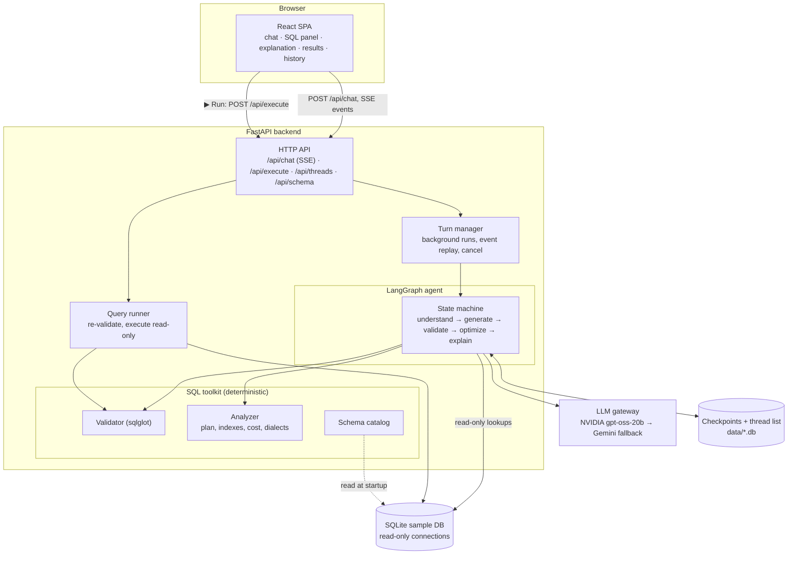
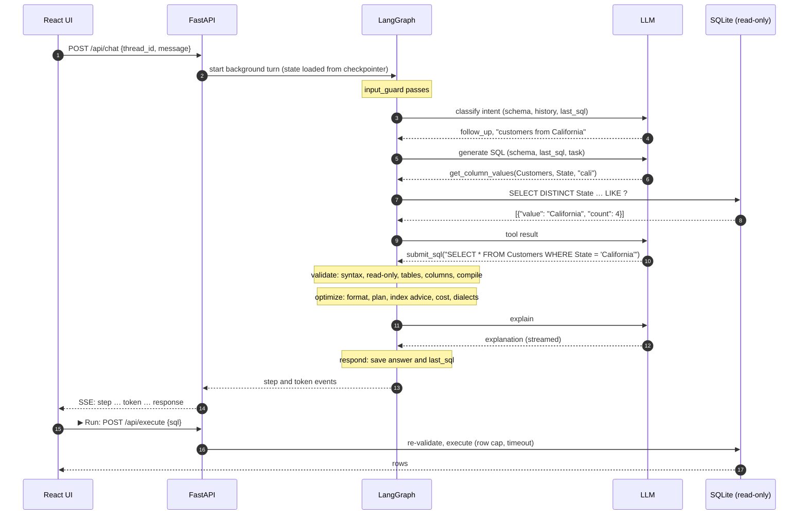
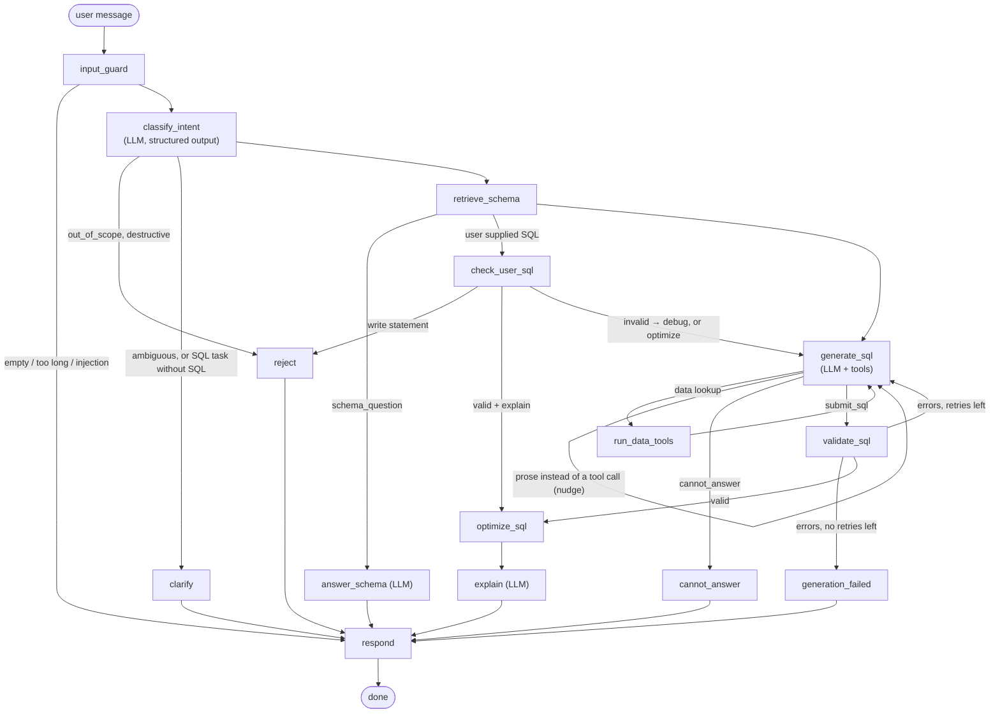

# Architecture

- [System overview](#system-overview)
- [Design principles](#design-principles)
- [Request lifecycle](#request-lifecycle)
- [LangGraph workflow](#langgraph-workflow)
- [Guardrails](#guardrails)
- [SQL validation](#sql-validation)
- [Data tools](#data-tools)
- [Optimization and cost estimation](#optimization-and-cost-estimation)
- [Conversation management](#conversation-management)
- [LLM providers](#llm-providers)
- [API](#api)
- [Frontend](#frontend)
- [Design decisions](#design-decisions)
- [Scaling path](#scaling-path)

## System overview



Each layer depends only on the ones below it: the agent doesn't import FastAPI, and the
validator never calls the LLM, so each part is tested on its own.

| Layer | Code | Responsibility |
|---|---|---|
| Presentation | `frontend/src` | Chat, SQL panel, results, history; re-attaches to running turns |
| API | `backend/app/api` | HTTP + SSE, background turns, thread list |
| Agent | `backend/app/graph` | LangGraph state machine, prompts in `app/prompts` |
| SQL toolkit | `validation/`, `optimization/`, `db/` | Validation, analysis, schema catalog |
| Execution | `runner/`, `tools/` | Read-only query execution for the user and the agent |
| LLM gateway | `llm.py` | Model creation, fallback, portable structured output |

## Design principles

1. **The LLM proposes, deterministic code decides.** Scope routing, SQL validation and execution
   safety are enforced in code, never only in a prompt.
2. **The agent explores; the user executes.** While writing SQL the agent may run small read-only
   lookups ("what values does `Orders.Status` hold?") instead of guessing. The final query only
   runs when the user clicks **Run**.
3. **Defense in depth.** The intent classifier refuses, the validator blocks, and the read-only
   connection makes writes impossible. Any single layer failing still leaves the system safe.
4. **Grounded in the real schema.** The schema is read from the database at startup, so the prompt
   and the validator can't disagree about which tables and columns exist.

## Request lifecycle

Example: **"Only those from California"**, sent after "Show all customers".



Out-of-scope ("Who won the World Cup?") and destructive ("Delete all orders") requests stop after
classification and never reach SQL generation.

## LangGraph workflow

Code: `backend/app/graph/builder.py` (graph), `nodes.py` (nodes and routing), `state.py`.



| Node | Type | Responsibility |
|---|---|---|
| `input_guard` | code | Reset per-turn state; reject empty, oversized or injection-pattern input |
| `classify_intent` | LLM | One of 9 intents, the request restated as a standalone task, any SQL the user supplied, a clarifying question |
| `reject` | code | Fixed refusal for out-of-scope and destructive requests |
| `clarify` | code | Ask for missing detail, or for the SQL to optimize/debug/explain |
| `retrieve_schema` | code | Schema context from the catalog |
| `answer_schema` | LLM | Questions about tables, columns and relationships |
| `check_user_sql` | code | Validate SQL the user pasted: explain it directly, switch to debugging if invalid, refuse writes |
| `generate_sql` | LLM + tools | Tool-calling loop ending in `submit_sql` or `cannot_answer` |
| `run_data_tools` | code | Run the requested read-only lookups (at most 4 per turn) |
| `validate_sql` | code | Full validation; errors become the `submit_sql` tool result so the model can fix them |
| `cannot_answer` | code | The schema doesn't hold the requested data |
| `generation_failed` | code | Still invalid after 2 retries: show the errors |
| `optimize_sql` | code | Format, index advice, anti-patterns, cost, dialects |
| `explain` | LLM | Plain-English explanation; the debug and optimize variants lead with what changed |
| `respond` | code | Build the response, append it to the conversation, save `last_sql` |

### Intents

| Intent | Example | Path |
|---|---|---|
| `generate` | "Top 5 customers by total order amount" | generate → validate → optimize → explain |
| `follow_up` | "Only those from California" | same, with the previous query to modify |
| `optimize` | "Optimize: SELECT …" | check → generate (rewrite) → validate → optimize → explain |
| `debug` | "This fails: SELECT …" | check (validator diagnosis) → generate (fix) → … |
| `explain_sql` | "What does this do? SELECT …" | check → optimize → explain (no generation) |
| `schema_question` | "What tables are there?" | answer_schema |
| `destructive` | "Delete all cancelled orders" | reject |
| `out_of_scope` | "Who won the FIFA World Cup?" | reject |
| `ambiguous` | "Show me that report again" | clarify |

### Key mechanisms

**Validation retry loop.** The model's final answer is a `submit_sql(sql, assumptions, notes)`
tool call. If validation fails, the errors come back as that tool's result
(`Unknown column 'region' in table(s) Customers. Did you mean: Customers.State?`) and the model
corrects the query in the same conversation. After 2 failed retries the turn ends with the errors.

**Tool use and structured output together.** Because the answer is itself a tool call, one
tool-bound model can both look up data and return structured output.

**Per-turn vs. persisted state.** The generator's tool conversation lives in `scratchpad`,
separate from the user-visible `messages`, and is reset every turn by `input_guard`. Only
`messages` and `last_sql` carry over between turns.

### State

```python
class AgentState(TypedDict, total=False):
    # Persisted across turns
    messages: Annotated[list[AnyMessage], add_messages]
    last_sql: str | None

    # Per turn
    user_input: str
    intent: str
    task: str                       # request restated as a standalone instruction
    input_sql: str | None           # SQL the user supplied
    clarification: str | None
    schema_context: str
    scratchpad: list[AnyMessage]    # generator's tool-calling conversation
    tool_calls: int
    tool_log: list[dict]            # data lookups, shown in the UI
    retries: int
    sql: str | None
    assumptions: list[str]
    notes: list[str]                # issues fixed (debug) or changes made (optimize)
    validation_errors: list[str]
    validation_warnings: list[str]
    optimization: dict | None
    explanation: str | None
    response: dict                  # final payload for the API
```

## Guardrails

| Threat | Layer 1 | Layer 2 | Layer 3 |
|---|---|---|---|
| Off-topic request | Classifier → `out_of_scope` | Generator's only non-SQL exit is `cannot_answer` | Validator requires at least one schema table (`SELECT 2 + 2` is rejected) |
| Destructive request | Classifier → `destructive` | Validator rejects any write/DDL node | Read-only connection (`mode=ro`, `PRAGMA query_only`) |
| Destructive SQL pasted in | `check_user_sql` refuses | Validator | Read-only connection |
| Hallucinated table/column | Schema in the prompt | Validator with "did you mean" feedback and retries | SQLite compile check |
| Prompt injection in the message | Regex guard before any LLM call | User text wrapped in `<user_message>` and declared as data | Classifier treats override attempts as out of scope |
| Prompt injection in database rows | Tool results labelled "data only" | Prompt tells the model not to follow instructions in tool output | Writes impossible regardless |
| Runaway query | Row cap (fetched incrementally) | Time limit via SQLite progress handler | Max 4 lookups per turn |
| SQL injection through tools | Table/column names resolved from the catalog | Search values bound as parameters | Read-only connection |

Refusal messages are fixed strings in code, not generated, so they can't be talked around.

## SQL validation

Code: `backend/app/validation/validator.py`. It runs on every query the agent submits, every
probe query it runs, and every query a user executes.

1. **Syntax:** parse with sqlglot (SQLite dialect); exactly one statement.
2. **Read-only:** the statement must be a query, and no `Insert`, `Update`, `Delete`, `Merge`,
   `Create`, `Drop`, `Alter`, `TruncateTable`, `Pragma`, `Attach`, `Transaction`, `Command`, …
   node may appear **anywhere** in the tree. This catches a `DELETE` hidden inside a CTE. The
   check allows only queries rather than blocking a list of statement types, because sqlglot
   parses some statements, such as `REINDEX`, as harmless-looking expressions.
3. **Tables:** every table exists in the catalog (CTE names excluded); other schemas are rejected;
   "Did you mean" suggestions.
4. **Columns:** every column resolves, including through aliases, CTEs and subqueries
   (sqlglot's `qualify`). Ambiguous columns are reported as such.
5. **Relationships:** join conditions are compared with declared foreign keys; joins that don't
   follow one, and joins without a condition, produce warnings.
6. **Engine check:** SQLite compiles the query in a zero-row dry run (`SELECT * FROM (…) LIMIT 0`).
   Plain `EXPLAIN` isn't enough, because SQLite only resolves function names when preparing a
   statement to run.

## Data tools

The schema catalog holds structure only (tables, columns, types, foreign keys, indexes), never
rows. When the agent needs to know what the data looks like, it asks:

| Tool | Purpose | Limit |
|---|---|---|
| `get_column_values(table, column, search?)` | Distinct values, most frequent first, optional case-insensitive substring filter | 25 values |
| `run_probe_query(sql)` | Small exploratory SELECT, e.g. the date range of `HireDate` | 20 rows, fully validated |

This is what turns "orders with status completed" into `Status = 'Delivered'`, recorded as an
assumption, instead of a query that silently returns nothing.

## Optimization and cost estimation

Code: `backend/app/optimization/analyzer.py`. It runs on every valid query; the LLM adds rewrites
and explanations for the `optimize` intent.

- **Formatting:** sqlglot pretty-print (adopted only if the result still validates)
- **Index recommendations:** from `EXPLAIN QUERY PLAN`. A column used in a WHERE or JOIN condition
  on a fully scanned table that isn't a primary key or the leading column of an index gets
  `CREATE INDEX …`
- **Anti-patterns:** `SELECT *`, functions wrapped around filtered columns (e.g.
  `strftime('%Y', HireDate)`), `LIKE '%…'`
- **Unnecessary joins:** a joined table that contributes no columns. For a `LEFT JOIN` it's called
  removable only when it matches on the joined table's primary key; otherwise it may duplicate rows
- **Cost estimate:** rows in fully scanned tables plus temporary sorts give `low` / `medium` / `high`
- **Dialects:** PostgreSQL and MySQL versions via `sqlglot.transpile`

## Conversation management

- **Memory:** LangGraph's `AsyncSqliteSaver` checkpoints state per `thread_id` in
  `data/checkpoints.db`. Conversations survive restarts.
- **Follow-ups:** the classifier sees recent history and `last_sql`; follow-ups get the previous
  query to modify.
- **History sidebar:** `data/threads.db` lists threads (titled after the first message). Each
  saved assistant message carries its full response, so reopening a thread restores the SQL panel.
- **Background turns:** a turn runs as a background task (`app/api/turns.py`), not tied to the
  HTTP connection. Switching conversations, or closing the tab, doesn't stop it. Its events are
  buffered, so opening the conversation again replays progress and then streams the rest.
  **Stop** cancels the task on the server. One turn runs per conversation at a time.
- **Errors are saved:** failed and stopped turns are written to the conversation like any other
  answer.

## LLM providers

Code: `backend/app/llm.py`. The graph never imports a vendor SDK. Models come from LangChain's
`init_chat_model`, configured by environment:

```bash
LLM_MODEL=nvidia:openai/gpt-oss-20b              # primary
LLM_FALLBACK_MODEL=google_genai:gemini-3.8-flash # on errors, rate limits, timeouts
```

- **Fallback:** each model "shape" (plain, tool-calling, structured output) is built for both
  models and joined with `.with_fallbacks()`. Fallbacks are applied after `bind_tools`, because a
  `RunnableWithFallbacks` can't bind tools.
- **Portable structured output:** Gemini uses its native JSON-schema mode. Other providers use a
  forced tool call parsed into the Pydantic model. The NVIDIA wrapper's default mode
  (`guided_json`) is rejected by NVIDIA's hosted endpoints, so the tool-call path is what makes
  NVIDIA work.
- **Lenient parsing:** `gpt-oss-20b` sometimes ignores the forced tool call and writes the
  arguments as JSON text instead. That JSON is accepted when it validates against the schema.
- **Retry:** a reply with no usable result is retried once. Rate limits and timeouts go straight
  to the fallback model.
- **Visible failures:** when both models fail, LangChain re-raises only the primary's error, so
  each model's failure is logged (`Primary model failed: …`, `Fallback model failed: …`).
- **Model choice:** Gemini's free tier allows only 20 requests per day per model (each question
  takes 3–5 calls). Of the NVIDIA models tested, `gpt-oss-20b` was fast and reliable with tool
  calling; DeepSeek and Nemotron timed out on the free tier.

## API

| Method | Path | Purpose |
|---|---|---|
| GET | `/api/health` | Status, configured models, whether the LLM is ready |
| POST | `/api/chat` | `{thread_id, message}`: start a turn, stream its events (409 if one is already running) |
| GET | `/api/threads/{id}/events` | Re-attach to a running turn: replays its events, then streams the rest (204 if idle) |
| POST | `/api/threads/{id}/cancel` | Stop the running turn |
| POST | `/api/execute` | `{sql}`: re-validate and run read-only; 400 with errors if rejected, 408 on timeout |
| GET | `/api/schema` | Tables, columns, foreign keys, indexes |
| GET | `/api/threads` | Conversations, most recent first, with a `running` flag |
| GET | `/api/threads/{id}` | Messages of one conversation, each assistant turn with its full response |
| DELETE | `/api/threads/{id}` | Delete a conversation and its checkpoints |

**SSE events:**

| Event | Data |
|---|---|
| `step` | `{node, label, detail?}`: a graph node finished (drives the progress indicator) |
| `token` | `{text}`: explanation text as the model writes it |
| `response` | Final payload: `type` (`sql`, `rejected`, `clarification`, `schema_answer`, `error`), `message`, and for SQL `sql`, `explanation`, `assumptions`, `notes`, `warnings`, `optimization`, `tool_log` |
| `error` | `{message}`: the turn failed or was stopped |

Streams send a keep-alive comment every 15 s and disable proxy buffering
(`X-Accel-Buffering: no`). If no API key is configured, the server still starts: `/api/health`
names the missing key, chat returns an `error` event, and schema browsing and execution keep working.

## Frontend

React 19 + Vite + TypeScript, plain CSS with light and dark themes.

```
┌──────────┬────────────────────────┬──────────────────────────┐
│ History  │  Chat                  │ [SQL] [Explanation]      │
│ ● running│  messages + live steps │ [Results]                │
│ threads  │  streamed explanation  │  highlighted SQL,        │
│ + New    │  example prompts       │  dialect · Copy ·        │
│          │  input · Stop          │  Download · ▶ Run        │
│          │                        │  cost, indexes, tips     │
│          │                        │  results table · CSV     │
└──────────┴────────────────────────┴──────────────────────────┘
```

- SSE is read with `fetch` and a stream reader, because `EventSource` only supports GET
- Switching conversations only detaches the browser; the turn continues on the server
- Below 1100px the sidebar is hidden; below 760px the panels stack (mobile)

## Design decisions

| Decision | Alternatives | Why |
|---|---|---|
| Fixed LangGraph state machine | Free-running ReAct agent | Predictable, testable, every step visible; tool use is confined to one node where it helps |
| Guardrails in code | Prompt-only rules | Models can be talked around; code can't |
| Answer as a `submit_sql` tool call | Structured output after tool use | One model handles lookups and structured answers; validation errors return as tool results |
| Agent reads data via capped tools | Sample values baked into the prompt | Always current, exact matches, no data in the prompt unless needed |
| User runs the final query | Agent executes automatically | The user stays in control; the agent's database access is limited to small lookups |
| SSE | WebSockets, polling | One-way streaming is all that's needed; stateless per request, scales horizontally |
| Background turns with replay | Tie the turn to the connection | Switching conversations or a flaky mobile connection doesn't lose work |
| Schema read from the database | Hand-written schema description | One source of truth; swapping databases needs no code changes |

## Scaling path

| Bottleneck | Fix |
|---|---|
| LLM latency and rate limits | Paid tier, response caching, fallback providers (already wired) |
| SQLite checkpointer (single file) | `PostgresSaver`, shared by several API replicas |
| In-process turn manager | Task queue (e.g. Redis) so any replica can serve re-attach requests |
| Ephemeral disk on free hosting | Postgres (e.g. Neon) for checkpoints and the thread list |
| SQLite data store | Postgres read replica for execution |
| Large schemas | Relevant-table retrieval in `retrieve_schema` (embeddings or keyword match) |
