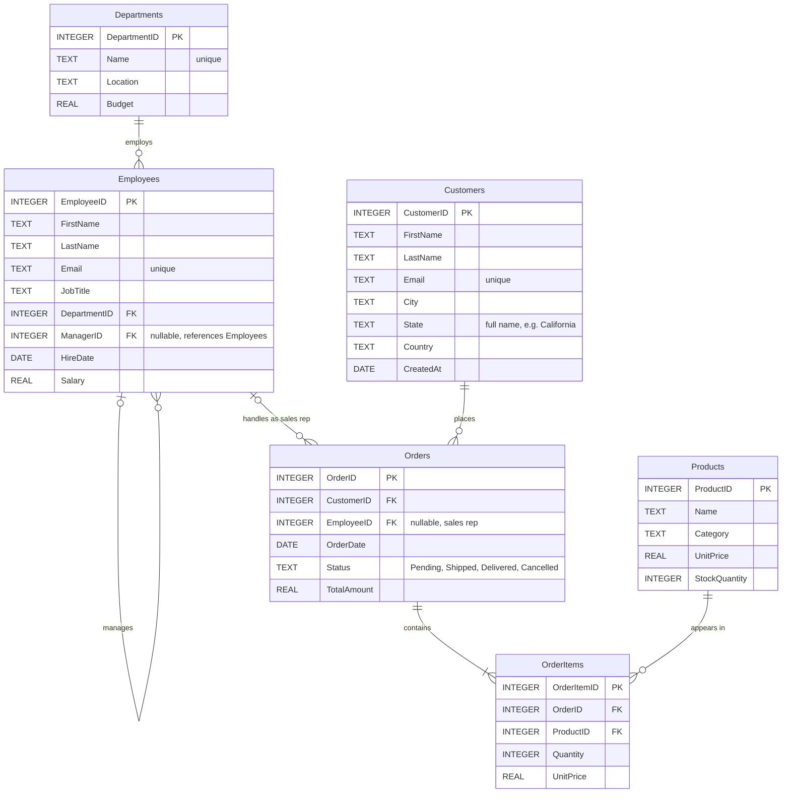

# Sample database schema

A small company database with an HR side (departments, employees) and a sales side (customers,
products, orders). Source: [`database/schema.sql`](../database/schema.sql) (structure) and
[`database/seed.sql`](../database/seed.sql) (data). Rebuild it with
`backend/.venv/bin/python database/init_db.py`.

The agent reads this structure from the database at startup, so replacing these files (or
pointing `DATABASE_PATH` at another SQLite database) needs no code changes.

## Entity-relationship diagram

## Tables

| Table | Rows | Description |
|---|---|---|
| `Departments` | 5 | Engineering, Sales, Marketing, HR, Finance, with location and budget |
| `Employees` | 15 | Staff with department, manager (self-reference), hire date and salary |
| `Customers` | 12 | Customers with city and US state |
| `Products` | 9 | Electronics, accessories, audio and furniture, with price and stock |
| `Orders` | 12 | Orders by customers, handled by a sales rep, with status and total |
| `OrderItems` | 19 | Order lines: product, quantity and the unit price at the time of sale |

### Relationships

| From | To | Meaning |
|---|---|---|
| `Employees.DepartmentID` | `Departments.DepartmentID` | Department the employee works in |
| `Employees.ManagerID` | `Employees.EmployeeID` | The employee's manager (NULL for department heads) |
| `Orders.CustomerID` | `Customers.CustomerID` | Customer who placed the order |
| `Orders.EmployeeID` | `Employees.EmployeeID` | Sales rep who handled the order |
| `OrderItems.OrderID` | `Orders.OrderID` | Order the line belongs to |
| `OrderItems.ProductID` | `Products.ProductID` | Product ordered |

### Indexes

Primary keys, unique `Email` and `Departments.Name`, plus `Employees(DepartmentID)`,
`Orders(CustomerID)` and `OrderItems(OrderID)`. Other filter columns (e.g. `Employees.HireDate`,
`Orders.Status`) are deliberately unindexed, so the optimizer has index recommendations to make.

## Data notes

The seed data is shaped to exercise the assignment's scenarios:

- **Dates** are stored as `TEXT` in `YYYY-MM-DD` format (SQLite has no date type).
- **6 employees were hired on or after 2024-01-01**, for the brief's first example.
- **4 customers are in California**, for the follow-up example ("Show all customers", then
  "Only those from California"). States are full names, so the agent must check values rather
  than guess `'CA'`.
- **Order statuses** are `Pending`, `Shipped`, `Delivered` and `Cancelled`. There's no
  "Completed", so a request for completed orders tests value mapping.
- **Every order's `TotalAmount` equals the sum of its line items**, so aggregate answers can be
  checked either way.
- **One product (HD Webcam) has never been ordered**, so "which products have never been ordered?"
  has a real answer.
